<div align="center">

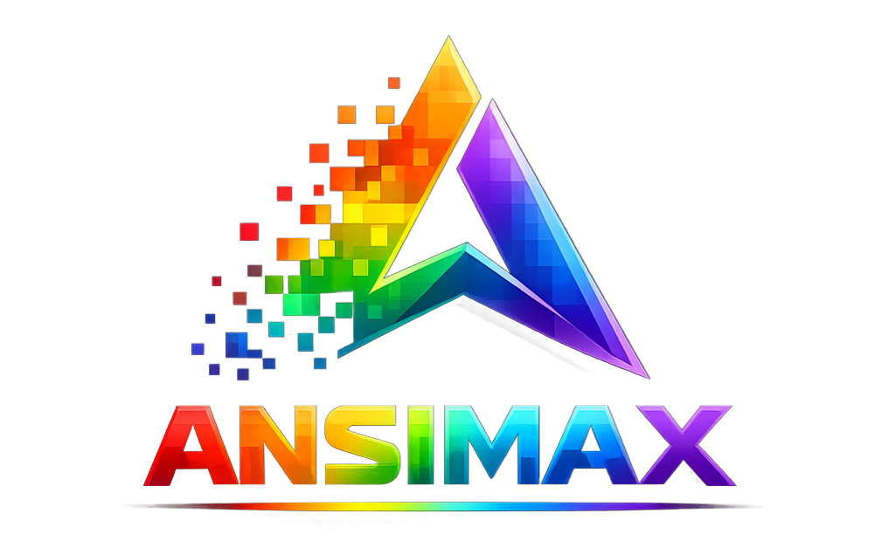

### La librería definitiva de renderizado CLI para Node.js

_Colores • Gradientes • Animaciones • ASCII Art • Pixel Art • Árboles • Componentes • Temas_

[](LICENSE)
[](https://www.npmjs.com/package/ansimax)
[](tsconfig.json)
[](#testing)
[](#testing)
[](#)
[](#)

[English](README.md) · **Español**

</div>

---

<div align="center">

### 🎬 Vista previa

<table>
  <tr>
    <td align="center">
      <strong>Animaciones</strong><br/>
      
    </td>
    <td align="center">
      <strong>Loaders</strong><br/>
      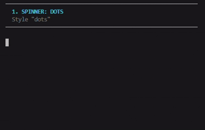
    </td>
  </tr>
</table>

</div>

---

## 🌟 ¿Qué es Ansimax?

Ansimax es una **librería de renderizado todo-en-uno** para construir interfaces de terminal hermosas en Node.js. Un solo paquete reemplaza un stack de más de 8 dependencias — colores, gradientes, ASCII art, spinners, barras de progreso, tablas, menús, árboles, temas, pixel art — combinadas en una única API coherente de TypeScript con **cero dependencias en runtime**.

```bash
npm install ansimax
```

```js
import { color, gradient, ascii, loader, sleep } from 'ansimax';

console.log(ascii.banner('hola', {
  colorFn: (t) => gradient(t, ['#ff79c6', '#bd93f9', '#8be9fd']),
}));

const stop = loader.spin('Construyendo proyecto', { color: '#bd93f9' });
await sleep(1500);
stop('Build completado', true);
```

---

## 💡 ¿Por qué Ansimax?

| Sin Ansimax | Con Ansimax |
|---|---|
| Instalar 8+ paquetes: `chalk`, `gradient-string`, `figlet`, `ora`, `cli-progress`, `cli-table3`, `boxen`, `inquirer` | Una sola instalación: `ansimax` |
| Mezclar APIs incompatibles, paradigmas diferentes, tipos en conflicto | API funcional consistente, fuente única de verdad |
| Sin sistema de temas coherente entre paquetes | Temas integrados (Dracula, Nord, Matrix, Cyberpunk, +5) |
| Limpieza manual del cursor, sin protección ante crashes | Cursor con conteo de referencias + handlers de crash integrados |
| Sin soporte de `AbortSignal` en la mayoría de libs CLI | Toda animación, loader y prompt es abortable |
| Cada lib trae su propia lógica de fallback en runtime | `NO_COLOR` / `FORCE_COLOR` / detección de TTY unificada |
| Sin límites de memoria en cachés de color | Cachés LRU acotadas en todo el código (sin fugas bajo carga) |

---

## 🆚 Comparación con el ecosistema Node.js

Ansimax reemplaza un stack de dependencias de librerías populares de Node.js con un solo paquete coherente y tipado:

| Característica | chalk | gradient-string | ora | cli-progress | figlet | boxen | inquirer | cli-table3 | **Ansimax** |
|---|:-:|:-:|:-:|:-:|:-:|:-:|:-:|:-:|:-:|
| Colores básicos + 256 | ✅ | — | — | — | — | — | — | — | ✅ |
| Truecolor con fallback adaptativo | ✅ | ✅ | — | — | — | — | — | — | ✅ |
| Gradientes multi-stop | — | ✅ | — | — | — | — | — | — | ✅ |
| **Gradientes animados** | — | — | — | — | — | — | — | — | 🔜 |
| Banners ASCII | — | — | — | — | ✅ | — | — | — | ✅ |
| Registro de fuentes personalizadas | — | — | — | — | parcial | — | — | — | ✅ |
| Cajas con múltiples estilos | — | — | — | — | — | ✅ | — | — | ✅ |
| Spinners (varios estilos) | — | — | ✅ | — | — | — | — | — | ✅ (11 estilos) |
| Barras de progreso animadas | — | — | — | ✅ | — | — | — | — | ✅ |
| **Tareas jerárquicas/paralelas** | — | — | — | — | — | — | — | — | ✅ |
| Tablas (multi-línea, conscientes de ANSI) | — | — | — | — | — | — | — | ✅ | ✅ |
| Menús interactivos + multi-select | — | — | — | — | — | — | ✅ | — | ✅ |
| **Árboles con detección de ciclos** | — | — | — | — | — | — | — | — | ✅ |
| **Pixel art + canvas + sprites** | — | — | — | — | — | — | — | — | ✅ |
| **Sistema de temas + aislamiento por instancia** | — | — | — | — | — | — | — | — | ✅ |
| `AbortSignal` en todas partes | — | — | parcial | — | — | — | parcial | — | ✅ |
| Soporte de `NO_COLOR` | ✅ | parcial | parcial | — | — | — | — | — | ✅ |
| TypeScript-first | parcial | parcial | ✅ | parcial | parcial | ✅ | parcial | parcial | ✅ |
| Cero dependencias en runtime | ✅ | — | — | — | — | — | — | — | ✅ |
| **Tamaño total de instalación** | pequeño | pequeño | medio | medio | medio | pequeño | grande | medio | **< 100 KB** |

---

## 📦 Instalación

```bash
npm install ansimax
# o
pnpm add ansimax
# o
yarn add ansimax
```

**Requisitos:** Node.js ≥ 18. Soporta ESM y CJS. Los ejemplos se publican junto con el paquete — ver [`/examples`](./examples).

---

## ⚡ Ejemplo en 30 segundos

```js
import { color, gradient, loader, ascii, sleep } from 'ansimax';

console.log(ascii.banner('deploy', {
  colorFn: (t) => gradient(t, ['#ff6b6b', '#feca57', '#48dbfb']),
}));

const stop = loader.spin('Construyendo proyecto', { color: '#bd93f9' });
await sleep(1500);             // simula trabajo asíncrono
stop('Build completado', true);  // ✓ + color de éxito

console.log(color.green('✓') + ' Listo en ' + color.bold('1.4s'));
```

---

## 🚀 Inicio rápido

```js
import { configure, color, themes, gradient } from 'ansimax';

// Configuración global
configure({ theme: 'dracula', animationSpeed: 'normal' });

// Estilos básicos
console.log(color.red('error'));
console.log(color.bold(color.cyan('importante')));

// Gradiente multi-stop
console.log(gradient('texto arcoiris', [
  '#ff5555', '#ffaa00', '#ffff00',
  '#00ff00', '#0099ff', '#cc44ff',
]));

// Cambiar tema — dispara los subscribers
themes.use('cyberpunk');
console.log(themes.primary('primary de cyberpunk'));
```

---

## ✨ Características

- 🎨 **Colores** — Truecolor / 256 / básico con fallback adaptativo. Detección de NO_COLOR / FORCE_COLOR / TTY
- 🌈 **Gradientes** — Lineales multi-stop, radiales, diagonales, ángulo arbitrario. Presets personalizados vía `registerPreset`
- 🔠 **ASCII Art** — Banners (fuentes `big`/`small`), cajas (6 estilos), divisores, logos. API de stream + registro de fuentes
- 🖼️ **Pixel Art** — Sprites, alpha blending, gradientes con dithering, canvas con renderizado dirty-rect, modo braille (sub-pixel 2×4)
- 🌳 **Árboles** — API builder + data plana, 4 estilos, colores/iconos por nodo, max-depth, detección de ciclos, algoritmos walk/find/map/filter
- 🎞️ **Animaciones** — Typewriter, fade, slide, pulse, wave, glitch, reveal. Conscientes de AbortSignal, modo reducedMotion
- ⏳ **Loaders** — 11 estilos de spinner, barras animadas, tareas jerárquicas/paralelas, cuentas regresivas, gestor multi-spinner
- 🎬 **Frames** — Reproducción secuenciada con pause/resume/seek, renderizador live push-based, timing con corrección de drift, morph
- 🧱 **Componentes** — Tablas (conscientes de ANSI, celdas multi-línea), badges, líneas de estado, secciones, columnas, timelines, menús interactivos
- 🎨 **Temas** — 8 built-in (Dracula, Nord, Monokai, Cyberpunk, Pastel, Matrix, Ocean, Sunset). Aislamiento por instancia, listeners `onChange`, helpers `bg*`
- ⚙️ **Configure** — Config centralizada con subscribers, updates batched, overrides temporales con `withConfig()`, modo strict
- 🛠️ **Utils** — Primitivas ANSI, control del cursor, hyperlinks de terminal (OSC 8), `setTitle`, `safeJson`, `onResize`, debounce/throttle/memoize

---

## 📸 Showcase

### Colores y Gradientes

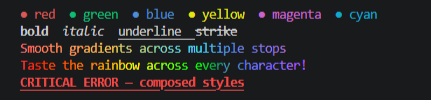

```js
import { color, gradient, rainbow } from 'ansimax';

// Colores básicos
console.log(color.red('rojo'), color.green('verde'), color.blue('azul'));

// Modificadores de estilo
console.log(color.bold('negrita'), color.italic('itálica'), color.underline('subrayado'));

// Gradiente multi-stop
console.log(gradient('fuego a océano', ['#ff6b6b', '#feca57', '#48dbfb']));

// Preset rainbow integrado
console.log(rainbow('preset rainbow integrado'));
```

### Gradientes animados (v1.2.0)

```js
import { animateGradient, sleep } from 'ansimax';

// Animación de flujo de color — corre hasta llamar stop()
const ctrl = animateGradient('Cargando...', ['#ff79c6', '#bd93f9', '#8be9fd'], {
  duration: 2000,    // ms por ciclo
  fps: 30,
  direction: 'forward',  // o 'reverse'
});

await sleep(3000);
ctrl.stop();

// v1.2.2: await directo (no se necesita .done)
await animateGradient('¡Listo!', ['#50fa7b', '#bd93f9'], {
  infinite: false, cycles: 2, duration: 800,
});
```

### Curvas de interpolación (v1.2.0)

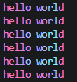

```js
import { gradient } from 'ansimax';

const stops = ['#ff79c6', '#bd93f9', '#8be9fd'];

// Cinco easings built-in + soporte para funciones personalizadas
console.log(gradient('hola mundo', stops, { easing: 'linear' }));
console.log(gradient('hola mundo', stops, { easing: 'ease-in' }));
console.log(gradient('hola mundo', stops, { easing: 'ease-out' }));
console.log(gradient('hola mundo', stops, { easing: 'ease-in-out' }));
console.log(gradient('hola mundo', stops, { easing: 'cubic-bezier' }));

// O tu propia función de easing (t → t suavizado, ambos en [0,1])
console.log(gradient('hola mundo', stops, { easing: (t) => t * t * t }));
```

### Gradientes cónicos (v1.2.0)

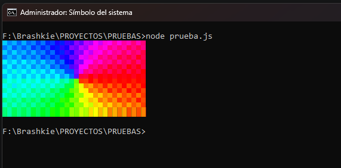

```js
import { gradientRect } from 'ansimax';

// Barrido radial alrededor del centro — rueda arcoíris
console.log(gradientRect({
  width: 30, height: 15,
  colors: ['#ff0000', '#ffff00', '#00ff00', '#00ffff', '#0000ff', '#ff00ff', '#ff0000'],
  style: 'conic',
  startAngle: 0,   // ángulo de rotación en grados
  dither: 'bayer',
}));
```

### Gradientes reusables (v1.2.3)

```js
import { createGradient, reverseGradient, ascii } from 'ansimax';

// Pre-resuelve los stops de hex una vez — significativamente más rápido para uso repetido
const fire = createGradient(['#ff5555', '#ffb86c', '#f1fa8c']);

console.log(fire('Primera línea'));
console.log(fire('Segunda línea'));
console.log(fire('Tercera línea'));

// Úsalo como colorFn para banners — misma firma de ColorFn
console.log(ascii.banner('FIRE', { colorFn: fire }));

// v1.2.4: inspecciona metadata
console.log('Stops:', fire.stops);             // → ['#ff5555', '#ffb86c', '#f1fa8c']
console.log('Resolved:', fire.resolvedStops);  // → [{r:255,g:85,b:85}, ...]

// v1.2.4: invierte un gradiente (preserva las opciones por defecto)
const ice = reverseGradient(fire);
console.log(ice('Lado frío'));

// Las opciones por-llamada aún funcionan — perfecto para animación
for (let p = 0; p < 1; p += 0.05) {
  process.stdout.write('\r' + fire('fluyendo', { phase: p }));
  await new Promise((r) => setTimeout(r, 50));
}
```

### ASCII Art

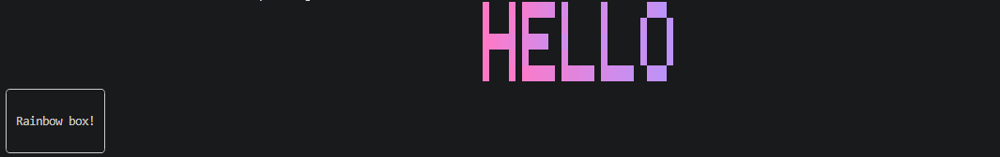

```js
import { ascii, gradient } from 'ansimax';

console.log(ascii.banner('HOLA', {
  font: 'big',
  align: 'center',
  colorFn: (t) => gradient(t, ['#ff79c6', '#bd93f9']),
}));

console.log(ascii.box('¡Caja arcoiris!', { padding: 1, borderStyle: 'rounded' }));
```

### Imagen → ASCII (v1.2.5)

```js
import { ascii } from 'ansimax';
import sharp from 'sharp';

// Obtén píxeles RGB raw de cualquier librería de imágenes — ejemplo con `sharp`.
// Puedes usar jimp, pngjs, canvas, o cualquier decoder. Ansimax sigue sin deps.
const { data, info } = await sharp('./foto.png')
  .raw()
  .toBuffer({ resolveWithObject: true });

// Convierte el buffer RGB raw → PixelGrid (un array 2D de objetos { r, g, b })
const pixels = [];
for (let y = 0; y < info.height; y++) {
  const row = [];
  for (let x = 0; x < info.width; x++) {
    const i = (y * info.width + x) * info.channels;
    row.push({ r: data[i], g: data[i + 1], b: data[i + 2] });
  }
  pixels.push(row);
}

// Ahora usa ansimax — varias formas:

// Monocromo
console.log(ascii.fromImage(pixels, { width: 80 }));

// Color + dithering Floyd-Steinberg + ramp detallado
console.log(ascii.fromImage(pixels, {
  width: 100,
  color: true,
  dither: 'floyd-steinberg',
  ramp: 'detailed',
}));

// Modo detección de bordes (line art)
console.log(ascii.fromImage(pixels, {
  width: 80,
  edgeDetect: 'sobel',
  edgeThreshold: 50,
  ramp: 'blocks',
}));

// Modo rostro para retratos (mejora contraste de tonos medios)
console.log(ascii.fromImage(pixels, {
  width: 60,
  ramp: 'detailed',
  faceMode: true,
}));
```

### Fuentes Figlet (v1.2.5)

```js
import { readFileSync } from 'node:fs';
import { parseFiglet, ascii, gradient } from 'ansimax';

// Descarga fuentes desde http://www.figlet.org/fontdb.cgi
const font = parseFiglet(readFileSync('./standard.flf', 'utf8'));

console.log(ascii.figletText('¡Hola!', font));

// Con color
console.log(ascii.figletText('STYLE', font, {
  colorFn: (t) => gradient(t, ['#ff79c6', '#bd93f9', '#8be9fd']),
}));
```

### Árboles

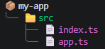

```js
import { tree, color } from 'ansimax';

const proyecto = tree({ label: 'mi-app', icon: '📦', color: color.bold });
const src = proyecto.add({ label: 'src', icon: '📁' });
src.addLeaf({ label: 'index.ts', icon: '📄' });
src.addLeaf({ label: 'app.ts',   icon: '📄' });

console.log(proyecto.render({
  style: 'rounded',
  palette: [color.cyan, color.green, color.magenta],
  guideColor: color.dim,
}));
```

### Pixel Art y Canvas

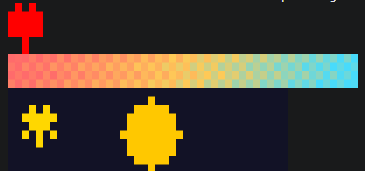

```js
import { images, createCanvas, gradientRect, SPRITES } from 'ansimax';

// Sprite integrado
console.log(images.sprite('heart'));

// Gradiente suave con dither Bayer
console.log(gradientRect({
  width: 50, height: 4,
  colors: ['#ff6b6b', '#feca57', '#48dbfb'],
  dither: 'bayer',
}));

// Canvas personalizado
const c = createCanvas(40, 10);
c.fill({ r: 18, g: 18, b: 38 });
c.drawCircle(20, 5, 4, { r: 255, g: 200, b: 0 }, true);
const starSprite = SPRITES.star;
if (starSprite) c.drawSprite(2, 2, starSprite.pixels);
c.print();
```

### Componentes

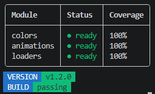

```js
import { components, color } from 'ansimax';

console.log(components.table([
  ['Módulo',     'Estado',                'Cobertura'],
  ['colors',     color.green('● listo'),  '100%'],
  ['animations', color.green('● listo'),  '100%'],
  ['loaders',    color.green('● listo'),  '100%'],
], { borderStyle: 'rounded' }));

console.log(components.badge('VERSION', 'v1.2.7'));
console.log(components.badge('BUILD',   'passing'));
```

### Timeline

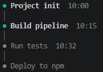

```js
import { components } from 'ansimax';

console.log(components.timeline([
  { label: 'Init del proyecto', done: true,  time: '10:00' },
  { label: 'Pipeline de build', done: true,  time: '10:15' },
  { label: 'Correr tests',      done: false, time: '10:32' },
  { label: 'Deploy a npm',      done: false },
]));
```

### Loaders y Progreso

```js
import { loader, sleep } from 'ansimax';

// Spinner con éxito/fallo
const stop = loader.spin('Cargando...', { color: '#bd93f9' });
await sleep(1500);
stop('¡Listo!', true);   // ✓ ícono verde

// Barra de progreso animada
await loader.progressAnimate(100, 'Descargando', {
  color: '#50fa7b', delay: 25,
});

// Tareas jerárquicas con ejecución paralela
await loader.tasks([
  {
    text: 'Build',
    fn: async () => await sleep(500),
    subtasks: [
      { text: 'TypeScript', fn: async () => await sleep(800) },
      { text: 'Bundle',     fn: async () => await sleep(600) },
    ],
  },
  { text: 'Test', fn: async () => await sleep(700) },
], { parallel: true });
```

### Animaciones

```js
import { animate, gradient, sleep } from 'ansimax';

await animate.typewriter('Bienvenido al wizard de deployment...', {
  speed: 30,
  colorFn: (t) => gradient(t, ['#bd93f9', '#ff79c6']),
});

await animate.fadeIn('Carga completa', { duration: 600 });

// Carrera de pasos contra timeout — nunca se cuelga
await animate.parallel([
  async () => await sleep(500),   // simulación de chequeo de red
  async () => await sleep(700),   // simulación de chequeo de base de datos
  async () => await sleep(400),   // simulación de chequeo de auth
], { timeout: 5000 });
```

### Temas

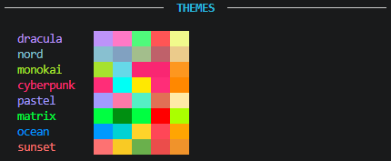

```js
import { themes, createTheme } from 'ansimax';

// Temas built-in
themes.use('dracula');
console.log(themes.primary('hola'));

// Escuchar cambios
const off = themes.onChange((nuevo, anterior) => {
  console.log(`Tema: ${anterior.name} → ${nuevo.name}`);
});

// Multi-tenant: cada instancia totalmente aislada
const tenantA = createTheme('nord');
const tenantB = createTheme('matrix');

// Definir un tema personalizado y registrarlo SÓLO en tenantA
tenantA.register('custom', {
  name: 'Custom',
  primary:   '#ff5e5e',
  secondary: '#5e5eff',
  accent:    '#5eff5e',
  success:   '#10b981',
  warning:   '#fbbf24',
  error:     '#ef4444',
  info:      '#06b6d4',
  muted:     '#6b7280',
  bg:        '#1e293b',
  surface:   '#334155',
  text:      '#f1f5f9',
  gradient:  ['#ff5e5e', '#5eff5e', '#5e5eff'],
});

console.log('tenantA incluye custom?', tenantA.list().includes('custom'));
console.log('tenantB incluye custom?', tenantB.list().includes('custom'));
//                                     ↑ false — aislamiento total
```

---

## 📚 Ejemplos

Once ejemplos de calidad de producción se publican en el paquete npm y son ejecutables directamente. Los encuentras en [`/examples`](./examples) después de instalar:

| Archivo | Qué demuestra |
|---|---|
| `01-quick-smoke.ts` | Test rápido de humo — verifica que cada import principal funciona |
| `02-colors-gradients.ts` | Toda función de color, tipos de gradiente, presets, compose, API chain |
| `03-ascii-banners.ts` | Banners (`big`/`small`), 6 estilos de caja, divisores, compositor de logos |
| `04-trees.ts` | Tree builder + API data-plana, 4 estilos, palettes, algoritmos (walk/find/map/filter) |
| `05-components.ts` | Tablas, badges, status, secciones, columnas, timelines, barras de progreso |
| `06-pixel-art.ts` | Sprites, canvas personalizado, gradient rects con dither, transforms (flip/rotate) |
| `07-animations.ts` | typewriter, fadeIn/Out, slide, pulse, wave, glitch, reveal |
| `08-loaders.ts` | Estilos de spinner, progreso animado, tareas jerárquicas, cuenta regresiva |
| `09-themes.ts` | Los 8 temas integrados, listeners, registro de temas personalizados, aislamiento por instancia |
| `10-everything.ts` | Showcase completo — cada módulo ejercitado en un demo cohesivo |
| `all-in-one.mjs` | Demo completo en **ESM** (JS puro con `import`) — sin necesidad de TypeScript |
| `all-in-one.cjs` | Demo completo en **CommonJS** (JS puro con `require`) — sin necesidad de TypeScript |

Ejecuta cualquier ejemplo con:
```bash
# Ejemplos en TypeScript
npx tsx examples/10-everything.ts

# JS puro — ESM
node examples/all-in-one.mjs

# JS puro — CommonJS
node examples/all-in-one.cjs
```

---

## 🎯 Casos de uso

- **Instaladores y scaffolders CLI** — hermosa experiencia de primer arranque (estilo create-react-app, create-next-app)
- **Herramientas DevOps** — dashboards de deployment, pipelines de build, monitores de salud
- **Dev experience** — mejores test runners, output de lint, formateo de errores
- **Prompts interactivos** — menús, confirmaciones, wizards multi-select
- **Exploración de datos** — tablas, árboles, charts para workflows terminal-first
- **Reportes de estado** — progreso en tiempo real, orquestación multi-tarea
- **Intros ASCII** — launchers de juego, splash screens, banners de login

---

## ⚙️ Configuración

La config global afecta cada módulo que la respeta (colores, temas, velocidad de animación, etc.):

```js
import { configure, getConfig, withConfig, onConfigKeyChange } from 'ansimax';

configure({
  colorMode:      'auto',     // 'none' | 'basic' | '256' | 'truecolor' | 'auto'
  animationSpeed: 'normal',   // 'slow' | 'normal' | 'fast' | 'instant'
  theme:          'dracula',  // cualquier tema registrado
  reducedMotion:  false,
});

// Escuchar cambios (por-key — evita disparos excesivos)
const off = onConfigKeyChange('theme', (nuevo, anterior) => {
  console.log(`Tema: ${anterior} → ${nuevo}`);
});

// Override temporal + restauración automática al completar o lanzar
await withConfig({ animationSpeed: 'fast' }, async () => {
  // ...tu código en modo fast aquí...
});

// Modo strict captura typos en config
// configure({ unknwnKey: 'x' }, { strict: true });  // lanza RangeError
```

---

## 🛣️ Roadmap

Ansimax se está construyendo hacia una **plataforma completa de renderizado de terminal** — una respuesta nativa de Node a lo que los desarrolladores de Python obtienen de `rich` + `textual` combinados, con mejoras específicas de Node donde importa.

El roadmap apunta intencionalmente — y busca superar — gaps que ni siquiera librerías TUI maduras de Python han resuelto completamente: renderers live-diff, gradientes animados, protocolos de imágenes en terminal, y una verdadera capa reactiva.

### ✅ Fase 1 — Fundamento core
- [x] Motor de estilos — ANSI 16 / 256 / truecolor con fallback adaptativo
- [x] Helpers Hex + RGB con clamping y validación
- [x] Soporte `NO_COLOR` / `FORCE_COLOR` + auto-detección no-TTY
- [x] Integración de `AbortSignal` en animaciones y loaders
- [x] Stacking de estilos `compose()` con emisión single-reset
- [x] Caché LRU acotada de escapes (512 entradas, key packed-RGB)
- [x] Registro de presets personalizados (`registerPreset`, `listPresets`)

### ✅ Fase 2 — Motor de gradientes
- [x] Gradientes lineales (multi-stop)
- [x] Rainbow + 6 presets built-in
- [x] Gradientes radiales (en `gradientRect`)
- [x] Gradientes diagonales
- [x] Gradientes a ángulo arbitrario
- [x] Dithering Bayer 4×4 para transiciones tonales suaves
- [x] UX single-stop (comportamiento estilo CSS)
- [x] **Gradientes animados** — flujo de color en el tiempo con `animateGradient()` (v1.2.0)
- [x] **Curvas de interpolación** — `linear` / `ease-in` / `ease-out` / `ease-in-out` / `cubic-bezier` / personalizado (v1.2.0)
- [x] **Gradientes cónicos** — barrido radial con `style: 'conic'` (v1.2.0)

### ✅ Fase 3 — Motor ASCII
- [x] Fuentes de bloque (`big`, `small`)
- [x] Banner con gradiente + alineación + coloreado por carácter
- [x] Dibujo de cajas (6 estilos de borde)
- [x] Divisores con variantes de estilo
- [x] Compositor de logos (gradiente + box wrapping)
- [x] Registro de fuentes personalizadas (`registerFont`, `hasFont`, `listFonts`)
- [x] API de stream (`ascii.stream()` con AbortSignal)
- [x] **Conversor Imagen → ASCII** — `ascii.fromImage()` con mapeo de luminancia (v1.2.5)
- [x] **Renderizado ASCII en color** — preserva colores de imagen con `color: true` (v1.2.5)
- [x] **Dithering de imágenes** — error diffusion Floyd-Steinberg (v1.2.5)
- [x] **ASCII optimizado para rostros** — histogram stretching para retratos (v1.2.5)
- [x] **Soporte de fuentes figlet** — parser + renderer `.flf` (`parseFiglet` + `ascii.figletText`) (v1.2.5)
- [x] **Detección de bordes** — operador Sobel integrado en `fromImage` (v1.2.5, bonus)

### ✅ Fase 4 — Primitivas TUI
- [x] Tablas (filas irregulares, celdas multi-línea, conscientes de ANSI)
- [x] Cajas con múltiples estilos
- [x] Mensajes de estado + badges (con opción de borde)
- [x] Timelines con estados done/pending
- [x] Menús interactivos (single + multi-select)
- [x] Layout de columnas (overflow truncate/wrap)
- [x] Secciones (cabeceras con gradiente, ancho automático)
- [x] Árboles (colapsables, max-depth, cycle-safe)
- [ ] **Panels** (split layouts: hsplit, vsplit)
- [ ] **Layouts** (posicionamiento estilo flexbox)
- [ ] **Sistema de grid** (spans column/row inspirados en CSS Grid)
- [ ] **Renderizado de Markdown** (headings, listas, code blocks, tablas)
- [ ] **Syntax highlighting** (gramáticas integradas)
- [ ] **Pretty-printing JSON/YAML** (con límite de profundidad + collapse)
- [ ] **Integración de logging** (drop-in para `console`/`pino`/`winston`)

### ✅ Fase 5 — Control de cursor y pantalla
- [x] Visibilidad de cursor, save/restore, posicionamiento, navegación por líneas
- [x] Limpieza de pantalla (línea, área, completa)
- [x] Cursor con conteo de referencias (calls superpuestas son seguras)
- [x] Restauración crash-safe (handlers de exit/SIGINT/SIGTERM)
- [x] Hyperlinks de terminal (OSC 8)
- [x] Título de ventana (OSC 2)
- [x] Bell (BEL)

### ✅ Fase 6 — Motor de animaciones
- [x] Typewriter, fadeIn, fadeOut, slide, pulse, wave, glitch, reveal
- [x] Conscientes de `AbortSignal`
- [x] Modo `reducedMotion` para accesibilidad
- [x] Frame morph (interpolación texto → texto, descifrado cinematográfico)
- [x] `parallel()` con timeout
- [x] Propagación de signal a animaciones anidadas
- [ ] **Librería de funciones easing** (24 easings estándar: cubic, elastic, bounce, back)
- [ ] **Composición de animaciones** (DSL `parallel + sequence + delay`)
- [ ] **Animaciones con física de spring** (estilo `react-spring`)
- [ ] **Motor de tween** (interpolar cualquier tipo de valor)

### 🟡 Fase 7 — Ecosistema de progreso
- [x] Spinners (11 estilos) con color + AbortSignal
- [x] Barras de progreso animadas
- [x] Runners multi-tarea (secuencial + paralelo)
- [x] Cuentas regresivas
- [x] Manager multi-spinner (spinners concurrentes apilados)
- [x] Tareas jerárquicas (rollup padre + subtareas)
- [ ] **Estimación live de ETA** (rolling average + proyección con filtro de Kalman)
- [ ] **Refresh live con diff renderer** (sin flicker, solo redibujar líneas cambiadas)
- [ ] **Grupos de progreso** (grupos con nombre y tema compartido)
- [ ] **Medidores de throughput** (bytes/s, ops/s con unidades auto-escaladas)

### 🟡 Fase 8 — Detección de capacidades
- [x] Detección de TTY (auto-desactivar en pipes/CI)
- [x] Soporte de env `NO_COLOR` / `FORCE_COLOR`
- [x] Detección de profundidad de color (16 / 256 / truecolor)
- [x] Detección de proveedor CI (GitHub Actions, CircleCI, GitLab, Buildkite, Drone, Travis)
- [x] Detección de programa de terminal (iTerm, vscode, WezTerm, Hyper, Apple_Terminal)
- [x] Detección de Windows Terminal (`WT_SESSION`)
- [ ] **Detección de ancho Unicode** (CJK halfwidth/fullwidth, clusters de emoji, ZWJ)
- [ ] **Detección de protocolos de imagen** (Sixel, imágenes inline de iTerm, protocolo de Kitty)
- [ ] **Base de datos de capacidades de terminal** (flags xterm completos + probes de versión)
- [ ] **Detección de métricas de fuente** (ancho/alto de celda para layouts pixel-accurate)

### 🟡 Fase 9 — Renderizado avanzado
- [x] Canvas dirty-rectangle (solo redibujar píxeles cambiados)
- [x] Cachés LRU acotadas (escape sequences, render cache, ANSI cache)
- [x] Timing con corrección de drift (animaciones permanecen pegadas al reloj)
- [ ] **Diff renderer** (damage tracking a nivel de línea para UIs completas)
- [ ] **Buffer virtual** (componer UI sin escribir a stdout)
- [ ] **Z-index / layering** (overlapping de paneles con prioridad)
- [ ] **Soporte de eventos de mouse** (click, hover, drag, scroll)
- [ ] **Abstracción de eventos de teclado** (flechas, modificadores, secuencias, dead keys)
- [ ] **Framework TUI completo** (componentes reactivos — equivalente a Textual para Node)

### 🔴 Fase 10 — Charts de terminal
- [ ] Barras (horizontal + vertical, agrupadas, apiladas)
- [ ] Líneas (con braille para resolución sub-carácter)
- [ ] Sparklines (mini-charts inline para status bars)
- [ ] Áreas (rellenas con gradientes)
- [ ] Heatmaps (grids 2D color-mapped)
- [ ] Pie / donut (con etiquetas de porcentaje)
- [ ] Scatter plots
- [ ] Box plots / candlestick
- [ ] Charts en streaming en tiempo real (feed de datos con ventana móvil)
- [ ] **Compositor de plots** (dashboards multi-chart con ejes compartidos)

### 🔴 Fase 11 — Formularios e input
- [ ] Prompts de texto (con autocomplete + historial)
- [ ] Prompts de password (mascarados, medidor de fortaleza)
- [ ] Diálogos de confirmación (yes/no con highlight de default)
- [ ] Input numérico (con validación min/max)
- [ ] Pickers de fecha/hora (widget calendario)
- [ ] Picker de archivos (navegador de filesystem)
- [ ] Compositor de formularios (multi-campo con validación + display de errores)
- [ ] **Flujos de wizard** (formularios multi-paso con back/forward, indicador de progreso)

### 🔴 Fase 12 — Imagen y media
- [ ] Renderizado de imágenes Sixel (xterm, mlterm, WezTerm)
- [ ] Imágenes inline de iTerm2 (protocolo base64)
- [ ] Protocolo gráfico de Kitty
- [ ] PNG/JPEG → imagen de terminal (auto-detecta mejor protocolo)
- [ ] Preview de video (frame-por-frame a bajo FPS)
- [ ] Generación de códigos QR (con opciones de tamaño + nivel ECC)
- [ ] Generación de códigos de barras (Code 128, EAN-13)

### 🔴 Fase 13 — Sistema de plugins
- [ ] API de plugins para componentes personalizados
- [ ] Marketplace de temas
- [ ] Registro de fuentes personalizadas vía paquetes npm
- [ ] Registro de animaciones de la comunidad
- [ ] Interfaz de proveedor de capabilities (plug-in para detectores propios)
- [ ] Plugins de renderer (cambiar stdout por cualquier writable stream)

### 🔴 Fase 14 — Capa reactiva (framework TUI)
- [ ] **Ciclo de vida de componentes** (hooks mount/unmount/update)
- [ ] **Estado reactivo** (auto re-render al cambiar data, signals o hooks)
- [ ] **Diffing de Virtual DOM** (updates a nivel de línea)
- [ ] **Event bus** (comunicación entre componentes)
- [ ] **Loop de aplicación** (árbol de render único con ciclo de vida completo)
- [ ] **Routing** (apps multi-pantalla con historial)
- [ ] **Integración DevTools** (inspector de árbol de componentes, mark de nodos cambiados)
- [ ] **CSS-in-TS styling** (estilos con scope por componente)

**Leyenda:** ✅ Completo · 🟡 Parcial · 🔴 Planeado

---

## 🧪 Testing

```bash
npm test              # Correr todos los 1700+ tests
npm run test:watch    # Modo watch
npm run test:coverage # Reporte de cobertura
```

Targets de cobertura:
- Statements: **98%**
- Branches: **95%**
- Functions: **99%**
- Lines: **99%**

---

## 🛠️ Requisitos

- **Node.js** ≥ 18
- **TypeScript** ≥ 5.0 (para consumo tipado — opcional)
- **Terminal** con soporte truecolor recomendado (Windows Terminal, iTerm2, WezTerm, Kitty, xterm moderno). Degrada gracefully a 256 / 16 / sin-color.

---

## 🏗️ Estructura del proyecto

```
ansimax/
├── src/
│   ├── colors/         Renderizado de color + motor de gradientes
│   ├── themes/         Sistema de temas + 8 built-ins
│   ├── ascii/          Banners, cajas, fuentes
│   ├── animations/     Typewriter, fade, slide, pulse, wave, glitch, reveal
│   ├── loaders/        Spinners, progreso, tareas, multi-loader
│   ├── frames/         Reproducción secuenciada + renderer live + morph
│   ├── components/     Tablas, badges, status, timelines, menús
│   ├── images/         Sprites, canvas, gradientes con dither
│   ├── trees/          Builder de árboles + algoritmos
│   ├── utils/          Primitivas ANSI + helpers
│   └── configure.ts    Config global + subscribers
├── examples/           10 ejemplos (TS) + 2 (JS — ESM y CJS) — todas las funciones cubiertas
└── __tests__/          16 test suites, 1700+ tests
```

---

## 📝 Changelog

### v1.2.7 — Correcciones + robustez

Release patch enfocado en manejo de edge cases y mejor DX:

- 🐛 **`fromImage` rechaza dimensiones inválidas explícitamente** — `width: 0`, `NaN`, `Infinity` ahora retornan `''` en vez de clampear silenciosamente
- 🐛 **`figletText('')` retorna `''`** — antes retornaba filas vacías
- 🛡️ **Grids no-rectangulares manejados con gracia** — filas de distinto largo ya no crashean `fromImage`
- 🎯 **Códigos de error añadidos en todo el módulo ASCII** — `ANSIMAX_INVALID_FIGLET_HEADER`, `ANSIMAX_INVALID_FONT_NAME`, etc. para `catch` programático
- 📝 **Mejores mensajes de error** — `parseFiglet` ahora incluye snippet del input problemático

```js
try {
  ascii.registerFont('big', myFont);  // 'big' está reservado
} catch (e) {
  if (e.code === 'ANSIMAX_RESERVED_FONT_NAME') {
    ascii.registerFont('big', myFont, { force: true });  // override
  }
}
```

Drop-in replacement para `1.2.6`.

### v1.2.6 — Mejoras del módulo ASCII

Release patch con mejoras al motor ASCII:

- 🎨 **4 ramps built-in nuevos** — `binary`, `dots`, `shades`, `ascii64`
- 🖼️ **Opción `bgColor`** en `fromImage` — colores van al background (excelente con `ramp: 'binary'` para efecto foto)
- 🔆 **`brightness` y `contrast`** pre-ajuste en `fromImage` — afina el rango tonal sin re-procesar
- 📏 **Opción `kerning`** en `figletText` — controla el espacio entre glyphs
- 📄 **`figletText` multi-línea** — input con `\n` renderiza múltiples bloques FIGfont con `lineSpacing` opcional

```js
import { ascii, ASCII_RAMPS } from 'ansimax';

// Renderizado tipo-foto con bloques coloreados en background
console.log(ascii.fromImage(pixels, {
  width: 80,
  bgColor: true,
  ramp: 'binary',
  brightness: 0.1,
  contrast: 0.2,
}));

// Figlet multi-línea con espaciado
console.log(ascii.figletText('TITULO\nSUBTITULO', font, {
  kerning: 1,
  lineSpacing: 1,
}));
```

Drop-in replacement para `1.2.5`.

### v1.2.5 — Fase 3 completa: motor de imagen-a-ASCII

Release minor que cierra el roadmap del motor ASCII con 5 features nuevas:

- 🖼️ **`ascii.fromImage(pixels, opts)`** — Conversor Imagen → ASCII (input: `PixelGrid`)
- 🎨 **Renderizado ASCII en color** — `color: true` preserva los colores fuente
- 📐 **Dithering Floyd-Steinberg** — `dither: 'floyd-steinberg'` para gradientes tonales más suaves
- 👤 **Modo optimizado para rostros** — `faceMode: true` mejora contraste de tonos medios en retratos
- 🔠 **Soporte Figlet (.flf)** — `parseFiglet()` + `ascii.figletText()` para 250+ fuentes de comunidad
- ⚡ **Bonus: detección de bordes Sobel** — `edgeDetect: 'sobel'` para efectos line-art

```js
import { readFileSync } from 'node:fs';
import { ascii, parseFiglet } from 'ansimax';

// Construye un PixelGrid pequeño a mano (usa sharp/jimp/etc para imágenes
// reales — ver sección Imagen → ASCII arriba)
const pixels = [
  [{ r: 255, g: 0, b: 0 }, { r: 0, g: 255, b: 0 }],
  [{ r: 0, g: 0, b: 255 }, { r: 255, g: 255, b: 0 }],
];

// Imagen a ASCII (input desde sharp/jimp/etc, sin dependencia de decoder)
console.log(ascii.fromImage(pixels, {
  width: 80,
  color: true,
  dither: 'floyd-steinberg',
  ramp: 'detailed',
}));

// Renderizado Figlet
const font = parseFiglet(readFileSync('./standard.flf', 'utf8'));
console.log(ascii.figletText('¡Hola!', font));
```

Drop-in replacement para `1.2.4`.

### v1.2.4 — Utilidades de gradiente + inspectabilidad

Release patch añadiendo metadata de inspección y un helper `reverseGradient()`:

- 🔍 **`ReusableGradient` expone `.stops`, `.resolvedStops`, `.defaultOptions`** — todos congelados, todos de solo lectura
- 🔄 **Helper `reverseGradient()`** — invierte el orden de stops de un gradiente (funciona con arrays o `ReusableGradient`)
- 🎯 **`presets` exportado con su nombre canónico** — junto al alias existente `colorPresets`

```js
import { createGradient, reverseGradient } from 'ansimax';

const fire = createGradient(['#ff5555', '#ffb86c', '#f1fa8c']);
const ice  = reverseGradient(fire);

console.log(fire.stops);  // ['#ff5555', '#ffb86c', '#f1fa8c']  — read-only
console.log(fire('cálido'));
console.log(ice('frío'));
```

Drop-in replacement para `1.2.3`.

### v1.2.3 — Factory de gradientes + performance

Release patch añadiendo una API orientada a performance:

- ⚡ **Factory `createGradient()`** — pre-resuelve los stops de hex una vez para reuso, ~40-60% más rápido en loops de animación y colorizado en bulk
- 📖 Más JSDoc con ejemplos ejecutables
- 🎯 Coincide con la firma `ColorFn` — funciona como `colorFn` en `ascii.banner`, themes, etc.

```js
import { createGradient, ascii } from 'ansimax';

const fire = createGradient(['#ff5555', '#ffb86c', '#f1fa8c']);
console.log(fire('¡Colores reusados!'));
console.log(ascii.banner('FIRE', { colorFn: fire }));
```

Drop-in replacement para `1.2.2`.

### v1.2.2 — Pulido de calidad

Release patch enfocado en ergonomía de API y refinamientos de robustez.

- ✨ **`animateGradient` ahora es thenable** — `await animateGradient(...)` directo sin `.done`
- 🎯 **Códigos de error estables** — los errores de tema llevan propiedad `.code` (`ANSIMAX_UNKNOWN_THEME`, etc.) para `catch` programático
- 🛡️ **Seguridad en sandboxes** — `animateGradient` ya no crashea cuando `process.stdout` no está disponible (workers, edge runtimes)
- 📖 **Mejor JSDoc** — `gradient()` ahora muestra IntelliSense completo con ejemplos
- 🐛 **Fix de README** — snippet de Easing Curves ahora es ejecutable copy-paste

Drop-in replacement para `1.2.0`.

### v1.2.0 — Fase 2 completa: gradientes animados, easing y cónicos

Release minor que cierra el roadmap del motor de gradientes con tres features potentes:

- 🌊 **`animateGradient()`** — flujo de color en el tiempo con ciclo de vida apropiado (Promise, signal, fps, direction)
- 📐 **Curvas de interpolación** — `linear` / `ease-in` / `ease-out` / `ease-in-out` / `cubic-bezier` / funciones personalizadas
- ⭕ **Gradientes cónicos** — `gradientRect({ style: 'conic', startAngle })` para barridos radiales

```js
import { animateGradient } from 'ansimax';

const ctrl = animateGradient('Cargando...', ['#ff79c6', '#bd93f9', '#8be9fd']);
await sleep(3000);
ctrl.stop();
```

Totalmente retrocompatible — todo programa 1.1.x corre idénticamente.

### v1.1.2 — Madurez y robustez

Release patch enfocado en refinamientos de calidad — sin cambios en la API.

- 🛡️ **Bump defensivo de `process.setMaxListeners`** — previene `MaxListenersExceededWarning` en setups con HMR / nodemon / ts-node-dev donde los módulos de ansimax re-registran handlers de restauración de cursor
- 🧪 **`TypeError` uniforme para validación de themes** — `themes.register()` ahora arroja consistentemente `TypeError` para errores estructurales / de tipo (antes era mezcla de `Error` y `TypeError`)
- 🎯 **`themes.use()` arroja `RangeError`** para nombres de tema desconocidos (antes `Error`) — mejor match semántico con "valor fuera del set permitido"
- 📝 **Re-exports más limpios en el barrel** — comentario de header ahora documenta aliases legacy y recomienda nombres canónicos

Drop-in replacement para `1.1.1`.

### v1.1.1 — Fixes de bugs + ejemplos limpios

Release patch que arregla dos bugs encontrados en testing real de v1.1.0, más una carpeta de ejemplos refrescada.

- 🐛 **Fix de crash en `box()`** con `padding: { x, y }` — ahora cae graciosamente al default para padding no-numérico (también maneja NaN, Infinity, strings)
- 🐛 **Fix de leak de cursor en `components.menu()`** al salir abruptamente (Ctrl+C, SIGTERM) — handlers de cleanup de emergencia ahora restauran el cursor incluso cuando el proceso se mata mid-menu
- 📚 **Nuevos ejemplos** — 10 ejemplos en TypeScript + 2 variantes en JS puro (`all-in-one.mjs` para ESM, `all-in-one.cjs` para CommonJS)
- 📖 **READMEs actualizados** — GIFs de preview en el header, GIF de showcase completo en el footer

Sin cambios en la API — drop-in replacement para `1.1.0`.

### v1.1.0 — Hardening exhaustivo + nuevas features

Una pasada masiva de robustez sobre todo módulo, más un nuevo módulo `trees`. **100% retrocompatible** — toda API existente funciona idéntica.

**Highlights:**

- 🌳 **Nuevo módulo `trees`** — API builder + API data-plana, 4 estilos, detección de ciclos, algoritmos (`walk`, `find`, `count`, `map`, `filter`)
- ⚙️ **Mejoras de `configure.ts`** — `onConfigKeyChange`, `pauseListeners` / `resumeListeners`, `withConfig()`, modo strict
- 🎨 **Themes** — aislamiento por instancia (multi-tenant safe), `tryUse`, listeners `onChange`, `unregister`, helpers `bg*`, accesor dinámico `style(name)`
- 🌈 **Colors** — `registerPreset` / `listPresets`, caché LRU acotada, RGB safe ante NaN/Infinity, UX de gradient single-stop
- 🖼️ **Images** — `Pixel` / `PixelGrid` exportados, deep-clone en `canvas.pixels`, coords defensivas, caché ANSI LRU acotada
- 🔠 **ASCII** — `hasFont`, `measure`, `stream` con AbortSignal, grapheme-aware
- 🎞️ **Frames** — cursor con conteo de refs, restauración crash-safe, `repeat: 0` = infinito, fps cap a 60, corrección de drift
- 🧱 **Components** — `menu([])` retorna `MENU_CANCELLED` (no throw), inputs numéricos defensivos en todas partes
- 🛠️ **Utils** — `setTitle`, `link` (hyperlinks OSC 8), `bell`, `safeJson` (BigInt + circular), `once`, `escapeRegex`, `padBoth`, `nextTick`, `memoize` con keyFn personalizado, `debounce` con `maxWait`, `onResize` con throttle
- 🧪 **Tests** — ~1700+ tests en 16 suites, todos verdes, ~98% de cobertura

Ver [CHANGELOG.md](CHANGELOG.md) para el historial completo de versiones con desglose por módulo.

### v1.0.0 — Release inicial

- Módulos core: `color`, `animate`, `ascii`, `loader`, `frames`, `components`, `themes`, `images`, `configure`
- Tipos TypeScript exportados, build dual ESM + CJS
- Renderizado de color adaptativo (detección NO_COLOR / FORCE_COLOR / TTY)
- Soporte de `AbortSignal` en todas las APIs bloqueantes
- 750+ tests, 85%+ cobertura

---

## 🤝 Contribuir

¡Las contribuciones son bienvenidas! Áreas donde la ayuda es especialmente apreciada:

- Nuevos presets de animación (easings, física spring)
- Fuentes ASCII adicionales (parser de figlet `.flf`)
- Entradas en la base de capacidades de terminal
- Traducciones (fr, de, ja, ...)
- Apps de ejemplo del mundo real
- Implementaciones de charts (Fase 10)

Por favor lee [CONTRIBUTING.md](.github/CONTRIBUTING.md) para las guías.

---

## 🐛 Reportar issues

¿Encontraste un bug? ¿Tienes una sugerencia? [Abre un issue](https://github.com/Brashkie/ansimax/issues/new).

Para divulgaciones de seguridad, envía un email a [security@brashkie.dev](mailto:security@brashkie.dev) en lugar de abrir un issue público.

---

## ⭐ Apoyo

Si Ansimax te ahorra tiempo, por favor dale estrella al repo en [GitHub](https://github.com/Brashkie/ansimax) — ayuda al proyecto a crecer y acelera el roadmap.

---

## 👨‍💻 Autor

**Brashkie** · [@Brashkie](https://github.com/Brashkie)

---

## 🎬 Showcase completo

<div align="center">


_Todas las funciones en acción — typewriter, gradientes, banners ASCII, árboles, tablas, spinners, temas y pixel art_

</div>

---

## 📜 Licencia

[Apache License 2.0](LICENSE) © 2026 Brashkie

Ansimax está licenciada bajo **Apache License, Version 2.0** — una licencia permisiva que permite uso comercial, modificación, distribución, e incluye un grant explícito de patentes. Ver el archivo [LICENSE](LICENSE) para el texto completo.

---

**Keywords:** cli, terminal, ansi, colors, gradients, animation, spinner, ascii, ascii-art, pixel-art, progress-bar, loader, components, table, banner, theme, tree, trees, tui, typescript, nodejs, zero-dependencies, chalk, ora, boxen, figlet, inquirer

---

<div align="center">

**Construido con ❤️ y TypeScript**

Si Ansimax te ayuda a hacer mejores CLIs, ¡dale ⭐ en [GitHub](https://github.com/Brashkie/ansimax)!

</div>
