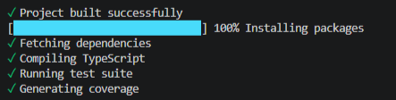
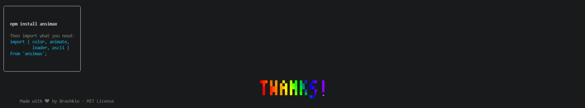

<div align="center">


# Ansimax

### The ultimate CLI rendering library for Node.js

Colors • Gradients • Animations • ASCII Art • Pixel Art • Components • Themes

[](#)
[](LICENSE)
[](tsconfig.json)
[](#)
[](#)
[](#)

**English** · [Español](README.es.md)

</div>

---

## 🎬 Live Preview

See Ansimax in action — every animation and loader running live:

### Animations

https://github.com/Brashkie/ansimax/raw/main/media/animations.mp4

### Loaders

https://github.com/Brashkie/ansimax/raw/main/media/loaders.mp4

> 💡 GitHub renders these MP4s as inline video players once the repo is pushed. Or run them locally with `npx tsx examples/animations.ts` and `npx tsx examples/loaders.ts`.

---

## 🌟 What is Ansimax?

**Ansimax** is a modern, zero-dependency rendering library for Node.js that turns your terminal into a vibrant, dynamic canvas. It bundles advanced ANSI colors, smooth animations, ASCII art, pixel art, interactive components, and theming into a single package — all written in strict TypeScript with full type definitions.

Built for developers who want to ship CLIs that **feel** professional.

---

## 💡 Why Ansimax?

- ⚡ **Zero dependencies** — no bloat, no transitive vulnerabilities, no version conflicts
- 🎯 **One library instead of 10** — replaces `chalk` + `ora` + `cli-table3` + `figlet` + `gradient-string` + more
- 🎨 **True 24-bit color + gradients** out of the box — auto-fallback to 256/16 when needed
- 🧠 **Built for real-world CLIs** — `AbortSignal` support, `NO_COLOR` compliance, TTY-aware
- 🛡️ **100% test coverage** — 750+ tests across every module
- 📘 **TypeScript-first** — strict mode, full type defs, zero `any`

---

## 🆚 Comparison

| Feature              | **Ansimax** | chalk | ora  | cli-table3 | figlet | gradient-string |
|----------------------|-------------|-------|------|------------|--------|-----------------|
| 16-color             | ✅          | ✅    | ➖   | ➖         | ➖     | ➖              |
| 256-color            | ✅          | ✅    | ➖   | ➖         | ➖     | ➖              |
| Truecolor (24-bit)   | ✅          | ✅    | ➖   | ➖         | ➖     | ✅              |
| Gradients            | ✅          | ❌    | ❌   | ❌         | ❌     | ✅              |
| Animations           | ✅          | ❌    | ❌   | ❌         | ❌     | ❌              |
| Spinners             | ✅          | ❌    | ✅   | ❌         | ❌     | ❌              |
| Progress bars        | ✅          | ❌    | ❌   | ❌         | ❌     | ❌              |
| Tables               | ✅          | ❌    | ❌   | ✅         | ❌     | ❌              |
| ASCII art / banners  | ✅          | ❌    | ❌   | ❌         | ✅     | ❌              |
| Pixel art / canvas   | ✅          | ❌    | ❌   | ❌         | ❌     | ❌              |
| Themes               | ✅          | ❌    | ❌   | ❌         | ❌     | ❌              |
| AbortSignal support  | ✅          | ❌    | ❌   | ❌         | ❌     | ❌              |
| Zero dependencies    | ✅          | ❌    | ❌   | ❌         | ❌     | ❌              |

> Ansimax replaces 5+ separate packages with a single zero-dependency library.

---

## 📦 Installation

```bash
npm install ansimax
```

```bash
yarn add ansimax    # Yarn
pnpm add ansimax    # PNPM
bun add ansimax     # Bun
```

**Requires Node.js >= 18**

---

## ⚡ 30-second example

```ts
import { color } from 'ansimax';

console.log(color.green('Hello world'));
```

That's it. No config, no setup. Want more? Keep reading.

---

## 🚀 Quick Start

```ts
import { color, animate, loader, ascii, components, gradient } from 'ansimax';

// Colors with stacked styles (single ANSI reset, no nesting)
console.log(color.bold(color.cyan('Hello, terminal!')));

// Gradient text
console.log(gradient('Smooth color flow', ['#ff6b6b', '#feca57', '#48dbfb']));

// Animated typewriter
await animate.typewriter('Welcome to Ansimax...', { speed: 50 });

// Spinner with success state
const stop = loader.spin('Building project...', { color: '#00ff88' });
await doWork();
stop('Built successfully', true);

// ASCII banner
console.log(ascii.banner('ANSIMAX', { font: 'big', align: 'center' }));

// Component table
console.log(components.table([
  ['Name', 'Status'],
  ['Build', '✓ ready'],
], { header: true, borderStyle: 'rounded' }));
```

---

## ✨ Features

| Module | Capabilities |
|---|---|
| 🎨 **Colors** | 16-color · 256-color · 24-bit truecolor · hex · RGB · `compose()` for stacking · `NO_COLOR` aware |
| 🌈 **Gradients** | Linear · multi-stop · rainbow · gradient rectangles (horizontal, vertical, diagonal, radial) |
| ⚡ **Animations** | typewriter · fadeIn · fadeOut · slide · pulse · wave · glitch · reveal — all `AbortSignal`-aware |
| 🔄 **Loaders** | 11 spinner styles · animated progress bars · multi-task runners (sequential & parallel) · countdowns |
| 🖼️ **ASCII Art** | Two built-in fonts · `box()` with 6 border styles · ANSI-aware dividers · banners with gradients |
| 🎬 **Frames** | Custom frame engines · live updating renders · loading bars · bouncing balls · **morph** (text→text) |
| 🧩 **Components** | Tables · status messages · badges · progress bars · timelines · interactive menus (single/multi-select) |
| 🌃 **Themes** | 8 built-in themes (Dracula, Nord, Monokai, Cyberpunk, Pastel, Matrix, Ocean, Sunset) · custom theme support |
| 🖌️ **Pixel Art** | Half-block rendering · sprite library · canvas drawing API · sprite transforms (flip, rotate) |
| 🛠️ **Utilities** | `truncateAnsi` · `wordWrap` (with soft-break) · `repeatVisible` · `stripAnsi` · color math |

---

## 📸 Showcase

### Colors & Gradients
<div align="center">
  
</div>

```ts
import { color, gradient, rainbow, compose } from 'ansimax';

// 16, 256, and 24-bit colors
color.red('basic');                          // 16-color
color.color256(196)('palette');              // 256-color
color.hex('#48dbfb')('truecolor');           // 24-bit
color.rgb(255, 100, 50)('custom');           // RGB

// Stack styles with compose() — single reset, no nesting
const errorStyle = compose(color.bold, color.red, color.underline);
console.log(errorStyle('CRITICAL ERROR'));

// Multi-stop gradients
gradient('Smooth flow', ['#ff6b6b', '#feca57', '#48dbfb']);
rainbow('Rainbow text!');
```

---

### ASCII Art
<div align="center">
  
</div>

```ts
import { ascii, rainbow } from 'ansimax';

ascii.big('HELLO');                   // 5-line block font
ascii.small('hello');                 // 3-line compact font
ascii.banner('ANSIMAX', {
  font: 'big',
  colorFn: rainbow,
  align: 'center',
});

// Boxes with 6 border styles
ascii.box(rainbow('Rainbow box!'), {
  borderStyle: 'double',
  padding: 2,
});

// ANSI-aware dividers
ascii.divider({
  label: color.cyan(' SECTION '),
  width: 60,
});
```

---

### Components
<div align="center">
  
</div>

```ts
import { components } from 'ansimax';

// Tables with auto-sizing
components.table([
  ['Name',    'Status',     'Score'],
  ['Alice',   '✓ active',   '95'],
  ['Bob',     '⚠ pending',  '78'],
], { header: true, borderStyle: 'rounded' });

// Status messages
components.status('success', 'All tests passed');
components.status('error',   'Build failed');
components.status('warn',    'Deprecation notice');

// Badges
components.badge('VERSION', 'v1.0.0');
components.badge('BUILD', 'passing');

// Interactive menus (with AbortSignal support)
const choice = await components.menu([
  'Install dependencies',
  'Run tests',
  'Deploy',
  'Cancel',
], { multiSelect: false });
```

---

### Timeline
<div align="center">
  
</div>

```ts
components.timeline([
  { label: 'Project init',   done: true,  time: '10:00' },
  { label: 'Build pipeline', done: true,  time: '10:15' },
  { label: 'Run tests',      done: true,  time: '10:32' },
  { label: 'Deploy to npm',  done: false, time: 'pending' },
]);
```

---

### Loaders & Progress
<div align="center">
  
</div>

```ts
import { loader } from 'ansimax';

// Spinner — 11 built-in styles
const stop = loader.spin('Processing...', {
  type: 'dots',          // dots, line, arrow, bounce, star, moon, clock...
  color: '#00ff88',
  signal: ctrl.signal,   // AbortSignal aware
});
stop('Complete', true);

// Animated progress bar
await loader.progressAnimate(50, 'Installing', {
  delay: 30,
  color: '#48dbfb',
});

// Multi-task runner — sequential or parallel
await loader.tasks([
  { text: 'Fetch deps',  fn: async () => fetch() },
  { text: 'Compile src', fn: async () => compile() },
  { text: 'Run tests',   fn: async () => test() },
], { parallel: false });

// Countdown
await loader.countdown(5, {
  label: 'Launching in',
  color: '#ffd700',
});
```

---

### Pixel Art & Canvas
<div align="center">
  
</div>

```ts
import { images, createCanvas } from 'ansimax';

// Built-in sprites: heart, star, smiley, pacman
console.log(images.sprite('heart', { scale: 2 }));

// Sprite transforms
const flipped = images.flipHorizontal(images.sprites.heart.pixels);
const rotated = images.rotate90(images.sprites.star.pixels);

// Custom canvas drawing
const canvas = createCanvas(30, 10);
canvas.drawRect(0, 0, 30, 10, { r: 30, g: 30, b: 50 }, true);
canvas.drawCircle(15, 5, 4, { r: 255, g: 200, b: 0 }, true);
canvas.print();

// Gradient rectangles — horizontal, vertical, diagonal, radial
images.gradientRect({
  width: 50, height: 8,
  colors: ['#ff0080', '#7928ca', '#0070f3'],
  style: 'radial',
});
```

---

### Themes
<div align="center">
  
</div>

```ts
import { themes, color } from 'ansimax';

// 8 built-in themes
themes.use('dracula');    // 'dracula', 'nord', 'monokai', 'cyberpunk',
                          // 'pastel', 'matrix', 'ocean', 'sunset', 'custom'

const t = themes.current();
console.log(color.hex(t.primary)('Primary text'));
console.log(color.hex(t.error)('Error message'));
console.log(color.hex(t.success)('Success!'));

// Define your own theme
themes.define('mytheme', {
  primary:   '#00ff88',
  secondary: '#0070f3',
  accent:    '#ffd700',
  error:     '#ff4757',
  warning:   '#ffa502',
  success:   '#2ed573',
});
```

---

### Get Started
<div align="center">
  
</div>

---

## 📚 Full Examples

The `examples/` folder contains runnable demos:

```bash
# TypeScript demo (all modules)
npx tsx examples/demo.ts

# JavaScript demo (CommonJS)
npm run build
node examples/demo.js

# Visual showcase (great for screenshots)
npx tsx examples/showcase.ts

# Animations recording demo
npx tsx examples/animations.ts

# Loaders recording demo
npx tsx examples/loaders.ts
```

---

## 🎯 Use Cases

- **Professional CLIs** — build tools that feel polished, not bare
- **Build outputs** — replace boring `npm run build` logs with status timelines
- **Interactive installers** — multi-select menus with theme support
- **Live dashboards** — auto-refreshing frame engine with diff rendering
- **Terminal games** — pixel art canvas + animation engine
- **Dev tooling** — coverage reports, deployment trackers, status panels
- **Educational tools** — animated explainers right in the terminal

---

## ⚙️ Configuration

```ts
import { configure } from 'ansimax';

configure({
  colorMode: 'truecolor',      // 'basic' | '256' | 'truecolor'
  animationSpeed: 'normal',    // 'slow' | 'normal' | 'fast'
});

// Or override at runtime
import { setNoColor } from 'ansimax';
setNoColor(true);  // disable all colors (CI environments)
```

Ansimax also respects the standard `NO_COLOR` environment variable and auto-detects non-TTY stdout (pipes, CI logs).

---

## 🛣️ Roadmap

Ansimax is being built toward a full **terminal rendering platform**. Here's what's done and what's next:

### ✅ Phase 1 — Core foundation (current)

- [x] **Styling engine** — ANSI 16 / 256 / truecolor with auto-fallback
- [x] **Hex + RGB helpers** with clamping and validation
- [x] **`NO_COLOR` env support** + non-TTY auto-detection
- [x] **`AbortSignal` integration** across animations and loaders
- [x] **`compose()` style stacking** with single-reset emission

### ✅ Phase 2 — Gradient engine

- [x] Linear gradients (multi-stop)
- [x] Rainbow presets
- [x] Radial gradients (in `gradientRect`)
- [x] Diagonal gradients
- [ ] **Animated gradients** (color flow over time)

### 🟡 Phase 3 — ASCII engine

- [x] Block fonts (`big`, `small`)
- [x] Banner with gradient + alignment
- [x] Box drawing (6 border styles)
- [ ] **Image → ASCII** converter (with edge detection)
- [ ] **Color ASCII** rendering (preserve image colors)
- [ ] **Image dithering** for better tonal range
- [ ] **Face-optimized ASCII** (high-detail mode for portraits)

### ✅ Phase 4 — Terminal UI primitives

- [x] Tables (irregular rows, jagged data)
- [x] Boxes with multiple styles
- [x] Status messages + badges
- [x] Timelines with done/pending states
- [x] Interactive menus (single + multi-select)
- [ ] **Trees** (collapsible, lazy-loadable)
- [ ] **Panels** (split layouts)
- [ ] **Layouts** (flexbox-style positioning)

### ✅ Phase 5 — Cursor & screen control

- [x] Cursor visibility, save/restore, positioning
- [x] Screen clearing (line, area, full)
- [x] Try/finally cleanup guarantees

### ✅ Phase 6 — Animation engine

- [x] Typewriter, fadeIn, fadeOut, slide, pulse, wave, glitch, reveal
- [x] All `AbortSignal`-aware
- [x] `reducedMotion` mode for accessibility
- [x] **Frame morph** (text → text interpolation)

### 🟡 Phase 7 — Progress ecosystem

- [x] Spinners (11 styles) with color + AbortSignal
- [x] Animated progress bars
- [x] Multi-task runners (sequential + parallel)
- [x] Countdown timers
- [ ] **Nested progress** (parent + children with rollup)
- [ ] **ETA estimation** (rolling average + projection)
- [ ] **Live refresh** without flicker (diff renderer)

### 🟡 Phase 8 — Capability detection

- [x] TTY detection (auto-disable in pipes/CI)
- [x] `NO_COLOR` env support
- [ ] **Color depth detection** (16 / 256 / truecolor)
- [ ] **Unicode width detection** (CJK, emoji)
- [ ] **Terminal capability database** (xterm, iTerm, Windows Terminal...)

### 🔴 Phase 9 — Advanced rendering

- [ ] **Diff renderer** (only redraw changed regions)
- [ ] **Virtual buffer** (compose UI without writing to stdout)
- [ ] **Z-index / layering**
- [ ] **Mouse event support**

### 🔴 Phase 10 — Terminal charts

- [ ] Bar charts (horizontal + vertical)
- [ ] Line charts (with braille for sub-character resolution)
- [ ] Sparklines
- [ ] Heatmaps
- [ ] Real-time streaming charts

### 🔴 Phase 11 — Plugin system

- [ ] Plugin API for custom components
- [ ] Theme marketplace
- [ ] Custom font registration
- [ ] Community animations registry

**Legend:** ✅ Complete · 🟡 Partial · 🔴 Planned

---

## 🧪 Testing

Ansimax ships with **750+ tests** and **100% line coverage**:

```bash
npm test                   # Run all tests
npm run test:coverage      # Coverage report
npm run typecheck          # Strict TypeScript check
```

---

## 🛠️ Requirements

- Node.js **>= 18.0.0**
- A terminal with ANSI escape support (every modern terminal)

---

## 🏗️ Project Structure

```
ansimax/
├── src/
│   ├── colors/          # Color system, gradients, compose, NO_COLOR
│   ├── animations/      # 7 animation effects with AbortSignal
│   ├── ascii/           # ASCII fonts, boxes, dividers, banners
│   ├── components/      # Tables, menus, timelines, badges
│   ├── loaders/         # Spinners, progress, tasks, countdowns
│   ├── frames/          # Frame engine + morph + presets
│   ├── images/          # Pixel art, sprites, canvas API
│   ├── themes/          # 8 built-in themes + custom
│   ├── utils/           # ANSI helpers, color math, string utils
│   └── index.ts         # Public API barrel
├── examples/            # Runnable demos (TS + JS)
├── media/               # README screenshots and videos
└── dist/                # Build output (CJS + ESM + types)
```

---

## 🤝 Contributing

Contributions are welcome! To get started:

1. **Fork** the repo
2. Create a branch: `git checkout -b feature/amazing-thing`
3. Add tests for your changes (the bar is 100% coverage)
4. Commit: `git commit -m 'Add: amazing thing'`
5. Push: `git push origin feature/amazing-thing`
6. Open a Pull Request

Make sure:
- All tests pass: `npm test`
- TypeScript is happy: `npm run typecheck`
- Code follows the existing style

---

## 🐛 Reporting Issues

Found a bug or have a feature idea? Open an [issue](https://github.com/Brashkie/ansimax/issues) — please include a minimal reproduction.

---

## ⭐ Support

If you like Ansimax:

- ⭐ **Star the repo** — helps others discover the project
- 🐛 **Report bugs** — open an [issue](https://github.com/Brashkie/ansimax/issues)
- 🚀 **Use it in your CLI projects** — that's the best support there is
- 📢 **Share it** — tweet, blog, mention it to a colleague who builds CLIs
- 💬 **Spread the word** — tag your CLI with `#ansimax` so others can find inspiration

This helps the project grow and gives momentum to add the planned features faster.

---

## 📝 Changelog

See [CHANGELOG.md](CHANGELOG.md) for the version history.

---

## 👨‍💻 Author

**Brashkie** · [@Brashkie](https://github.com/Brashkie)

---

## 📜 License

[MIT](LICENSE) © 2026 Brashkie

---

**Keywords:** cli, terminal, ansi, colors, gradients, animation, spinner, ascii, ascii-art, pixel-art, progress-bar, loader, components, table, banner, theme, typescript, nodejs, zero-dependencies

---

<div align="center">
  <p>Built with ❤️ and TypeScript</p>
  <p>If Ansimax helps you ship better CLIs, give it a ⭐ on GitHub!</p>
</div>